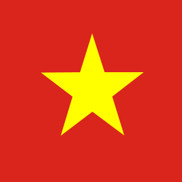
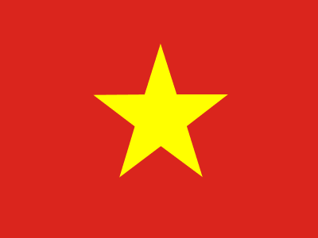
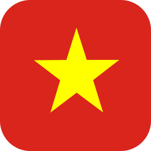

# FlagImageView 🏳️

A customizable Android `ShapeableImageView` to easily display country flags with different shapes and rounded corners.  
Published via **JitPack**.

---

## 🚀 Installation

### Step 1. Add JitPack to your `settings.gradle.kts`
```kotlin
dependencyResolutionManagement {
    repositoriesMode.set(RepositoriesMode.FAIL_ON_PROJECT_REPOS)
    repositories {
        google()
        mavenCentral()
        maven(url = "https://jitpack.io")
    }
}
```

### Step 2. Add the dependency in `build.gradle.kts` (app)
```kotlin
dependencies {
    implementation("com.github.haqt2003:flagimageview:1.0.0")
}
```

## 🎨 Usage

### XML
```xml
<com.haqt.flagimageview.FlagImageView
    android:id="@+id/fiv_flag"
    android:layout_width="100dp"
    android:layout_height="wrap_content"
    app:countryCode="us"
    app:shape="rectangle"
    app:cornerRadius="8dp"/>
```

### Kotlin
```kotlin
val flagView = findViewById<FlagImageView>(R.id.fiv_flag)

// Change country dynamically
flagView.countryCode = "jp" // Japan

// Change shape
flagView.shape = FlagImageView.Shape.SQUARE

// Change corner radius
flagView.cornerRadius = 12f
```

## ⚙️ Attributes

| Attribute      | Type   | Example             | Description                                                                 |
|----------------|--------|---------------------|-----------------------------------------------------------------------------|
| `countryCode`  | String | `"us"`             | ISO country code (lowercase). Example: `"us"`, `"jp"`, `"vn"`.              |
| `shape`        | Enum   | `"square"` or `"rectangle"` | Defines flag aspect ratio (1x1 or 4x3).                              |
| `cornerRadius` | Dimen  | `"8dp"`            | Rounded corner radius. If too large, automatically adjusts to max (circle/pill). |

## 📷 Screenshots

| Square Flag | Rectangular Flag | Rounded Corners |
|-------------|------------------|------------------|
|  |  |  |

*Place your screenshot images in a `screenshots/` folder in your repository and ensure the paths above match the file names.*

## 📦 Versioning

Tags follow [SemVer](https://semver.org/) format.  
Example: Release `v1.0.0` → use in Gradle as `1.0.0`.

## 📜 License

MIT License
